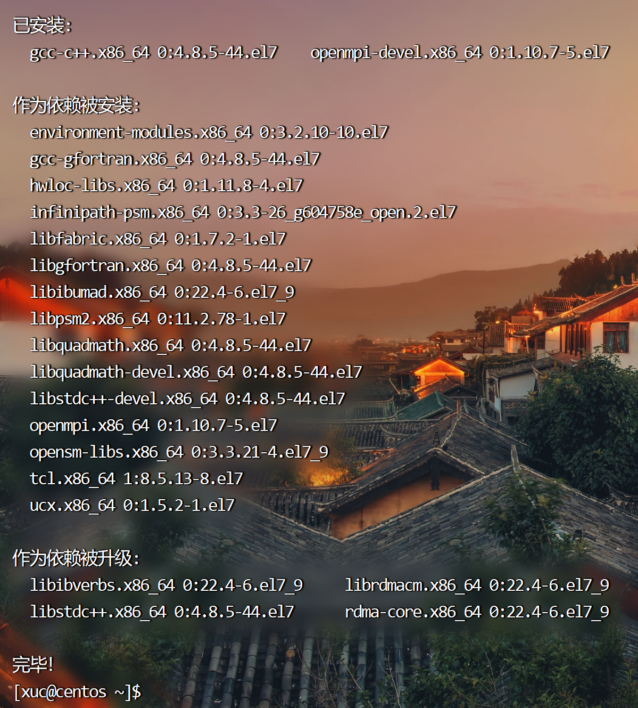
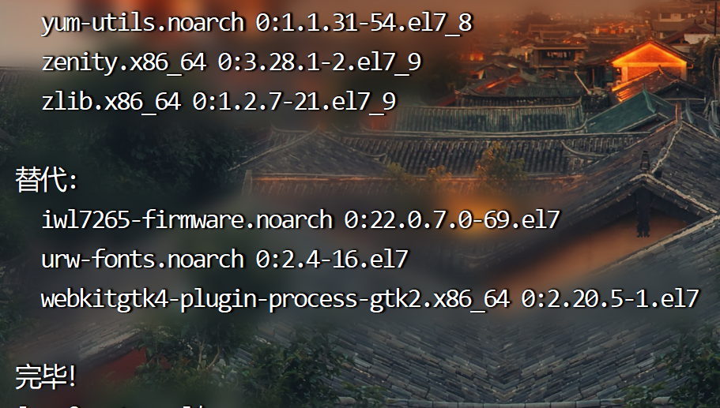
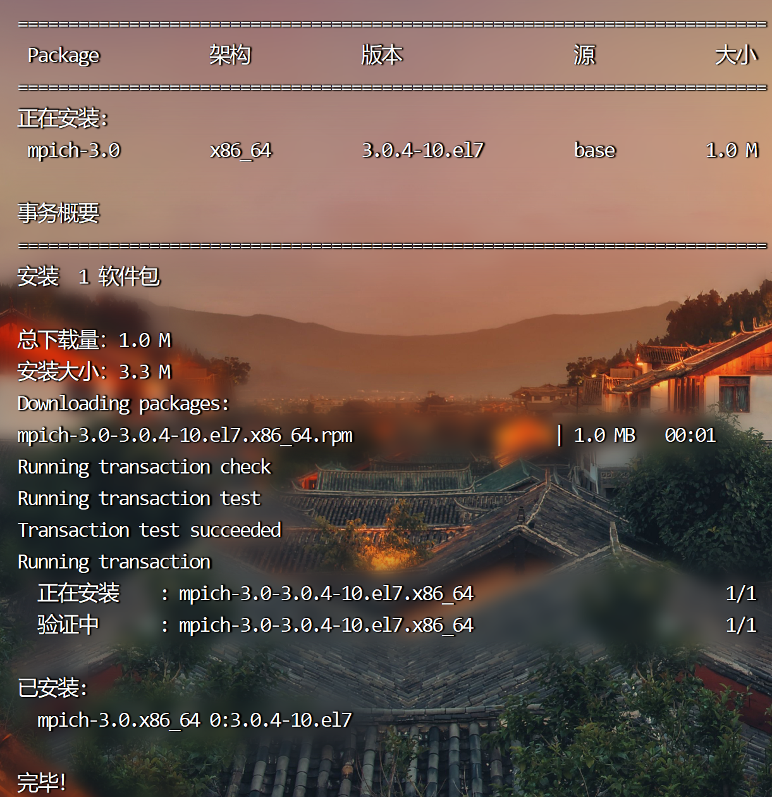
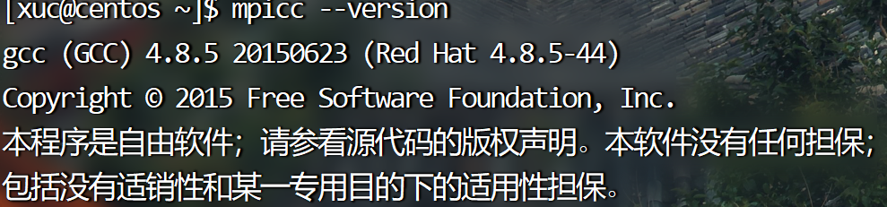
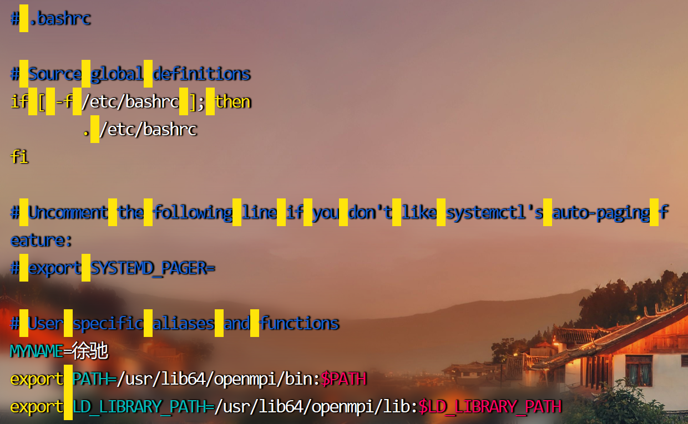
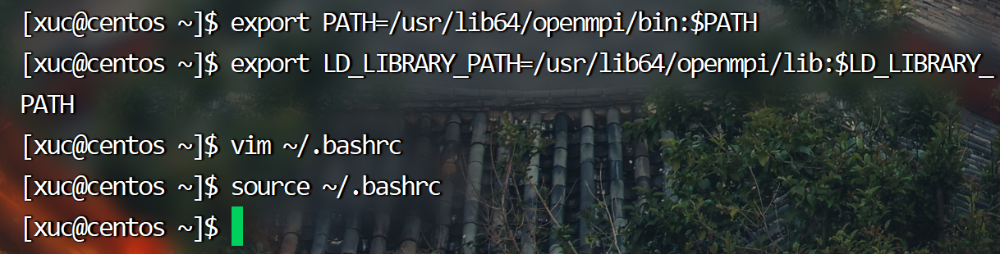
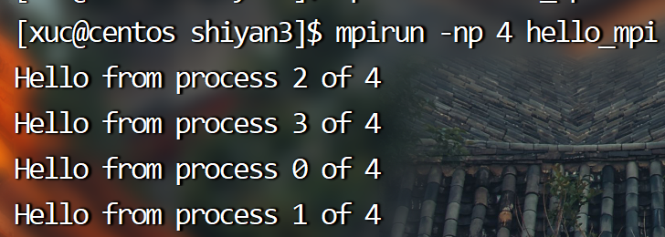
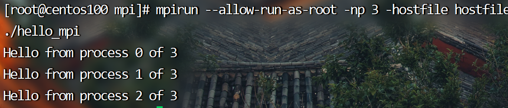
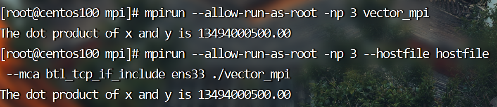
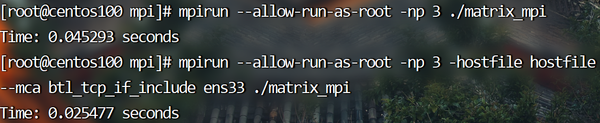

# 实验3 MPI实验

## 一、实验环境

- CentOS7 64位操作系统（CentOS Linux release 7.6.1810）（运行于虚拟机）

- VMware® Workstation 16 Pro-16.2.4 build-20089737 虚拟机软件

- FinalShell 3.9.8.2 终端软件，通过SSH与Linux虚拟机连接

- 硬件环境：

  设备名称	martinred
  处理器	AMD Ryzen 7 6800H with Radeon Graphics            3.20 GHz
  机带 RAM	16.0 GB (15.2 GB 可用)
  设备 ID	5FBC4275-DA53-4E4A-890E-0B2D7B2246AD
  产品 ID	00342-30700-55566-AAOEM
  系统类型	64 位操作系统, 基于 x64 的处理器

## 二、实验目的

1. 学习并了解MPI编程模型以及并行计算的基本概念。
2. 安装MPICH并了解其基本配置和使用方法。
3. 编写一个简单的MPI程序，以了解MPICH的基本概念和用法。
4. 编写一个跨节点的MPI程序，以了解在分布式环境下如何使用MPICH进行并行计算。

## 三、实验内容

### 1. MPICH的安装与使用

#### 1.1 MPICH的安装

##### 1.1.1 安装MPI及其所需的依赖项

命令如下：

```bash
sudo yum -y install gcc gcc-c++ openmpi-devel
```

实际运行结果：



##### 1.1.2 打开终端更新yum仓库；安装MPICH

命令如下：

```bash
sudo yum update
sudo yum -y install mpich
```

实际运行展示：





##### 1.1.3 验证MPI是否安装成功

命令：

```bash
mpiexec --version
mpicc --version
```

实际运行展示：




##### 1.1.4 配置环境变量

命令如下：

```bash
export PATH=/usr/lib64/openmpi/bin:$PATH
export LD_LIBRARY_PATH=/usr/lib64/openmpi/lib:$LD_LIBRARY_PATH
vim ~/.bashrc
```

修改`~/.bashrc`文件，文末添加代码，使环境变量的修改永久有效：

```bash
export PATH=/usr/lib64/openmpi/bin:$PATH
export LD_LIBRARY_PATH=/usr/lib64/openmpi/lib:$LD_LIBRARY_PATH
```

之后执行命令：

```bash
source ~/.bashrc
```

实际运行结果：

​	修改后的文件：

​	

​	命令展示：

​	

#### 1.2 编译运行测试程序

##### 1.2.1 测试程序源代码

```c
#include <stdio.h>
#include <mpi.h>

int main(int argc, char **argv)
{
    int rank, size; // rank 是当前进程的编号，size 是进程总数

    MPI_Init(&argc, &argv);               // 初始化 MPI 环境
    MPI_Comm_rank(MPI_COMM_WORLD, &rank); // 获取当前进程的编号
    MPI_Comm_size(MPI_COMM_WORLD, &size); // 获取进程总数

    printf("Hello from process %d of %d\n", rank, size);

    MPI_Finalize(); // 释放 MPI 资源

    return 0;
}
```

##### 1.2.2 编译运行程序

使用如下命令：

```bash
mpicc -o hello_mpi hello_mpi.c
mpirun -np 4 hello_mpi # 普通用户
mpirun --allow-run-as-root -np 4 hello_mpi # root 用户
```

实际执行过程：



##### 1.2.3 编译运行程序（多机运行）

在当前工作目录下创建`hostfile`文件，内容如下：

```bash
centos100
centos101
centos102
```

关闭防火墙

```bash
systemctl stop firewalld
```

运行

```
mpirun -np 3 -hostfile hostfile ./hello_mpi # 普通用户
mpirun --allow-run-as-root -np 3 -hostfile hostfile ./hello_mpi # root 用户
```

实际执行过程：



### 2.编程实现大规模向量/矩阵并行计算

#### 2.1 大规模向量运算

##### 2.1.1 程序源代码

```c
#include <mpi.h>
#include <stdio.h>
#include <stdlib.h>

#define VECTOR_SIZE 300

int main(int argc, char **argv)
{
    MPI_Init(&argc, &argv);

    int rank, size;
    MPI_Comm_rank(MPI_COMM_WORLD, &rank);
    MPI_Comm_size(MPI_COMM_WORLD, &size);

    double *x, *y;
    int i, n = VECTOR_SIZE / size;            // n 是每个进程的向量长度
    x = (double *)malloc(n * sizeof(double)); // x 和 y 是每个进程的局部向量
    y = (double *)malloc(n * sizeof(double));

    // 初始化局部向量
    for (i = 0; i < n; i++)
    {
        x[i] = i + rank * n;
        y[i] = i + rank * n + n;
    }

    // 计算局部内积
    double sum = 0.0;
    for (i = 0; i < n; i++)
    {
        sum += x[i] * y[i];
    }

    // 汇总局部内积
    double global_sum;
    MPI_Reduce(&sum, &global_sum, 1, MPI_DOUBLE, MPI_SUM, 0, MPI_COMM_WORLD);

    // 打印结果
    if (rank == 0)
    {
        printf("The dot product of x and y is %.2f\n", global_sum);
    }

    free(x);
    free(y);

    MPI_Finalize();
    return 0;
}
```

##### 2.1.2 程序运行结果



#### 2.2 大规模矩阵运算

##### 2.2.1 程序源代码

```c
#include <mpi.h>
#include <stdio.h>
#include <stdlib.h>

#define N 300 // 矩阵大小

int main(int argc, char **argv)
{
    int rank, size;

    MPI_Init(&argc, &argv);               // 初始化 MPI
    MPI_Comm_rank(MPI_COMM_WORLD, &rank); // 获取进程 ID
    MPI_Comm_size(MPI_COMM_WORLD, &size); // 获取进程数量

    if (size < 2)
    { // 至少需要两个进程
        fprintf(stderr, "Error: At least two processes required\n");
        MPI_Abort(MPI_COMM_WORLD, 1);
    }

    int i, j, k;
    double *matrixA, *matrixB, *matrixC;
    double startTime, endTime;

    // 每个节点分配矩阵
    matrixA = (double *)malloc(N * N / size * sizeof(double));
    matrixB = (double *)malloc(N * N / size * sizeof(double));
    matrixC = (double *)malloc(N * N / size * sizeof(double));

    // 初始化矩阵
    for (i = 0; i < N / size; i++)
    {
        for (j = 0; j < N; j++)
        {
            matrixA[i * N + j] = rank + 1;
            matrixB[i * N + j] = j + 1;
            matrixC[i * N + j] = 0;
        }
    }

    // 等待所有进程完成初始化
    MPI_Barrier(MPI_COMM_WORLD);

    // 计算矩阵乘积
    startTime = MPI_Wtime(); // 记录开始时间
    for (i = 0; i < N / size; i++)
    {
        for (j = 0; j < N; j++)
        {
            for (k = 0; k < N / size; k++)
            {
                matrixC[i * N + j] += matrixA[i * N + k] * matrixB[k * N + j];
            }
        }
    }
    endTime = MPI_Wtime(); // 记录结束时间

    // 等待所有进程完成计算
    MPI_Barrier(MPI_COMM_WORLD);

    // 将结果返回到主节点
    if (rank == 0)
    {
        double *temp = (double *)malloc(N * N * sizeof(double));
        MPI_Gather(matrixC, N * N / size, MPI_DOUBLE, temp, N * N / size, MPI_DOUBLE, 0, MPI_COMM_WORLD);
        printf("Time: %f seconds\n", endTime - startTime);
        free(temp);
    }
    else
    {
        MPI_Gather(matrixC, N * N / size, MPI_DOUBLE, NULL, N * N / size, MPI_DOUBLE, 0, MPI_COMM_WORLD);
    }

    // 释放内存并结束 MPI
    free(matrixA);
    free(matrixB);
    free(matrixC);
    MPI_Finalize();
    return 0;
}
```

##### 2.2.2 程序运行结果



## 四、实验总结

本次进行的OpenMPI实验，目的是研究并了解OpenMPI的使用。在实验中，我首先安装了MPICH，并通过make和make install命令成功编译和安装了MPICH。然后，我编写了一个简单的测试程序，并通过mpicc命令将其编译成可执行文件。我在单机多核和多机环境下运行测试程序，并成功实现了大规模向量计算和矩阵计算。在多机情况下，我需要配置主机名，并指定主机列表和进程数以运行程序。我也学习了如何使用MPI的广播、散射和聚集等基本通信原语，以及如何使用MPI的非阻塞通信函数实现异步通信。

通过本次实验，我深入了解了MPI的并行计算模型，掌握了MPI编程的基本技能和方法，以及如何在多机环境下使用MPI进行并行计算。此外，我还了解了MPI程序的性能优化和调试技巧，以及如何使用MPI的工具进行性能分析和调试，对提高程序的性能和可靠性具有重要意义。

总之，这个OpenMPI实验为我提供了宝贵的MPI并行计算经验，使我更加深入地了解了并行计算模型和并行计算的实现方法，为我今后的科研工作和学习提供了有力的支持和指导。